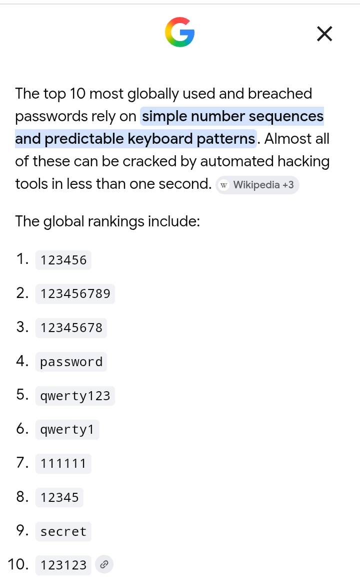
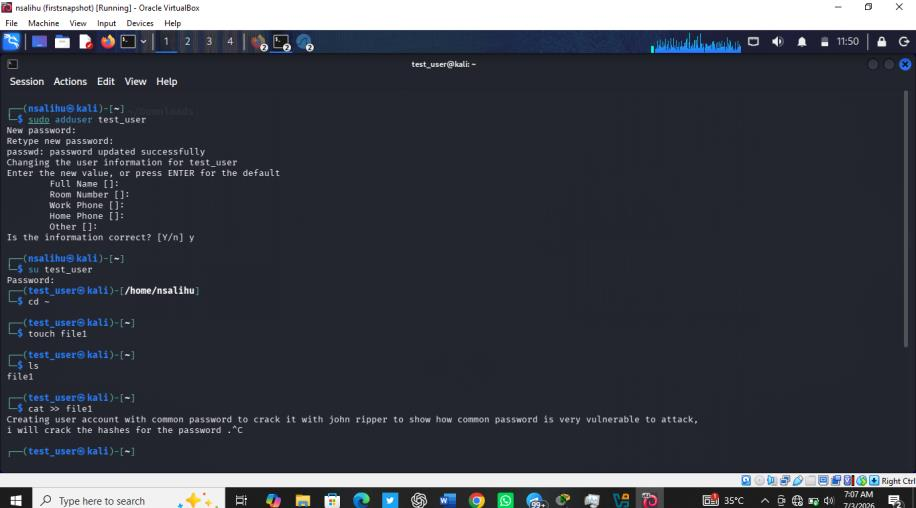
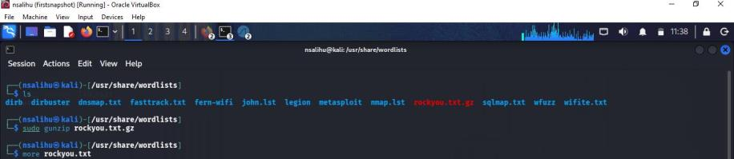
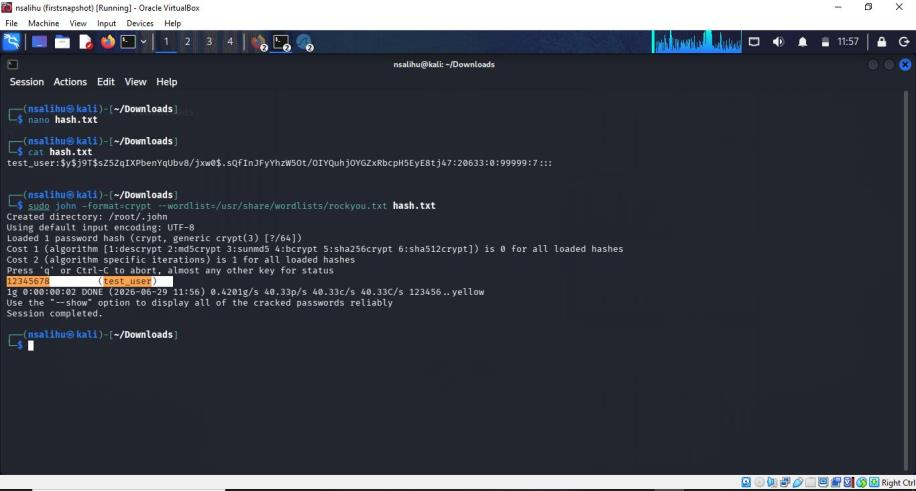

# 🔓 Password Security Assessment — Cracking Weak Linux Credentials with John the Ripper


A controlled lab exercise demonstrating how quickly a weak, commonly used password can be cracked using John the Ripper and the rockyou.txt wordlist — and what that means for real-world password security.

---

## 📌 Project Overview

This project documents a hands-on password-cracking exercise in a Kali Linux environment. A test Linux user account was created with a password known to appear on global top-10 most-used and most-breached password lists. Its password hash was extracted from the system and cracked using John the Ripper, illustrating the real-world risk that weak passwords pose to system security.

## 🎯 Objective

To demonstrate, in a controlled lab environment, how easily a weak or commonly reused password can be compromised using freely available password-cracking tools — and to translate that finding into concrete password security recommendations.

## 🛠️ Tools and Environment

- Kali Linux (Oracle VirtualBox)
- John the Ripper — password cracking utility
- rockyou.txt — dictionary wordlist included with Kali Linux
- Standard Linux shell commands (`adduser`, `su`, `cat`, `nano`)
- `zip2john` — utility for extracting hashes from password-protected ZIP files

## 🔑 Password Selection

Before creating the test account, research was conducted to identify the passwords most commonly used and most frequently found in real-world data breaches. Simple numeric sequences dominate the global rankings, with `12345678` sitting at position 3. This password was deliberately chosen for the test account to reflect a realistic, high-risk credential rather than an artificial example.


*Figure 1: Search results showing the top globally used and breached passwords*

## 🧪 Methodology

**Step 1 — Create the test user account**
A test account was created and assigned the password `12345678` to simulate an account secured with a common, weak password. A file was created inside the account to confirm it was active and functional.


*Figure 2: Test user account creation and verification in Kali Linux*

**Step 2 — Prepare the wordlist**
The `rockyou.txt` wordlist, located in the Kali Linux wordlists directory, was decompressed for use as the dictionary source.


*Figure 3: Locating and decompressing the rockyou.txt wordlist*

**Step 3 — Capture the password hash and run John the Ripper**
The password hash for the test account was retrieved from the system's shadow file and saved to a text file. John the Ripper was then run against the hash using the `rockyou.txt` wordlist.


*Figure 4: Hash capture and successful password recovery using John the Ripper*

## 💻 Command Reference

| Command | Purpose |
|---|---|
| `sudo adduser test_user` | Creates the test user account used for the demonstration |
| `su test_user` | Switches into the newly created test account |
| `touch file1` / `cat >> file1` | Creates and writes to a file to confirm the account is functional |
| `sudo gunzip rockyou.txt.gz` | Decompresses the rockyou.txt wordlist for use as a dictionary |
| `sudo cat /etc/shadow` | Displays the password hash of the created user |
| `nano hash.txt` | Saves the captured hash to a file for cracking |
| `sudo john --format=crypt --wordlist=/usr/share/wordlists/rockyou.txt hash.txt` | Runs John the Ripper against the hash using the rockyou.txt wordlist |
| `zip2john secure.zip > zip_hash.txt` | Extracts a crackable hash from a password-protected ZIP file |

## 📊 Findings

- The test account password `12345678` was successfully cracked in approximately **2 seconds**.
- The password was recovered using a standard dictionary attack with a publicly available wordlist and default John the Ripper settings — no custom rules or advanced techniques were required.
- The speed of the crack confirms that passwords found on common password lists offer little to no practical protection against offline attacks.

## 📦 Additional Use Case: Password-Protected Files

John the Ripper is not limited to system account passwords. A password-protected ZIP archive can be converted into a crackable hash format using `zip2john`, and the resulting hash attacked using the same dictionary-based method:

```
zip2john secure.zip > zip_hash.txt
```

This demonstrates that the same weak-password risks documented above extend beyond user accounts to any file or archive secured with a predictable password.

## ⚠️ Risk Analysis

This exercise confirms a well-established security risk: accounts or files protected with common or predictable passwords can be compromised almost instantly using freely available tools and wordlists. In a production environment, an attacker who gains access to a password hash — through a data breach, misconfigured file permissions, or a compromised backup — could recover weak credentials within seconds, leading to unauthorized account access, privilege escalation, or full system compromise.

## ✅ Recommendations

- Enforce a minimum password length of 12+ characters combined with complexity requirements
- Block known common and breached passwords during account creation (password blocklists)
- Implement multi-factor authentication (MFA) for all privileged and user accounts
- Restrict access to `/etc/shadow` and other files containing password hashes
- Use strong, adaptive hashing algorithms (e.g., bcrypt, scrypt, or Argon2) instead of weaker legacy hash formats
- Apply account lockout or rate-limiting policies to slow down brute-force and dictionary attacks

## 🛠️ Skills Demonstrated

- Password security assessment
- Offline password cracking (John the Ripper)
- Dictionary/wordlist-based attacks
- Linux shadow file and hash handling
- Vulnerability documentation and reporting
- Security recommendations and risk analysis

## 📂 Repository Contents

```
Password-Security-Assessment/
│
├── Password_Security_Assessment_John_the_Ripper.pdf   # Full lab report
├── screenshots/
│   ├── figure1_top_breached_passwords.png
│   ├── figure2_test_user_creation.png
│   ├── figure3_rockyou_wordlist.png
│   └── figure4_john_the_ripper_crack.png
└── README.md                                          # Project overview (this file)
```

## 🧾 Conclusion

This lab demonstrated, in a controlled environment, how quickly a weak or commonly used password can be cracked using John the Ripper and a standard wordlist. The exercise highlights why password strength and hashing practices are critical components of any organization's security posture, and reinforces the importance of enforcing strong password policies at both the system and application level.

---

## 👤 Author

**Nuhu Salihu**
Cybersecurity Student | Network Security Enthusiast | Aspiring Cybersecurity Analyst
📍 Kano, Nigeria
📧 salihunuhu994@gmail.com
🔗 GitHub: [@Nsalihu300](https://github.com/Nsalihu300)

---

⭐ If you find this project useful, feel free to explore the repository and the accompanying lab report.
